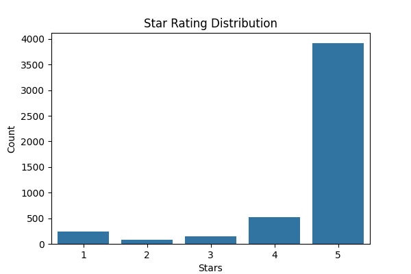
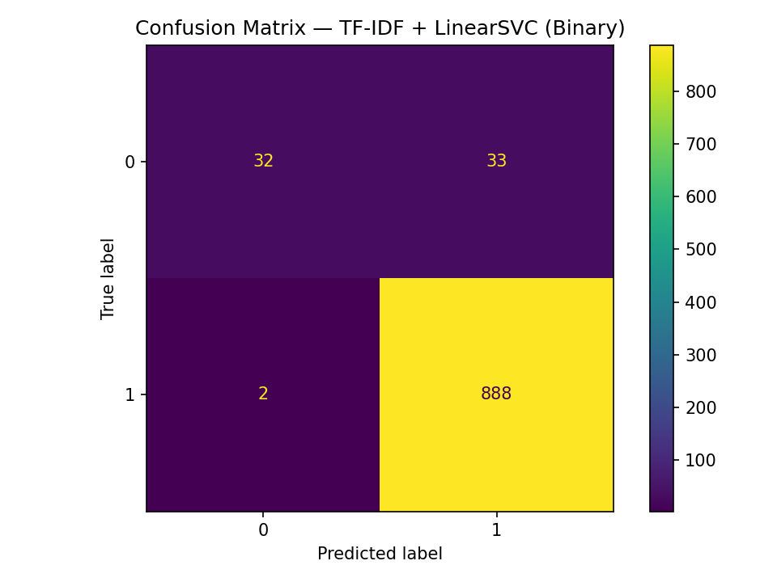
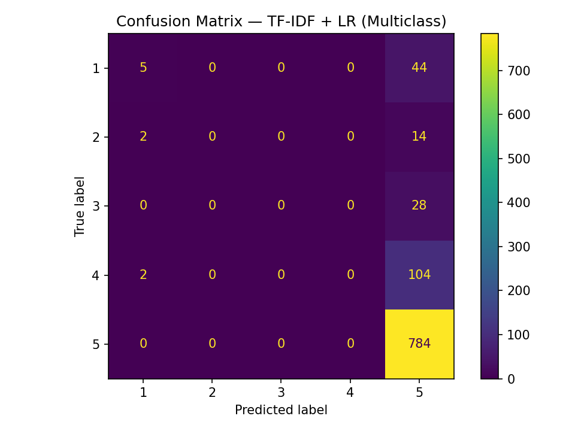
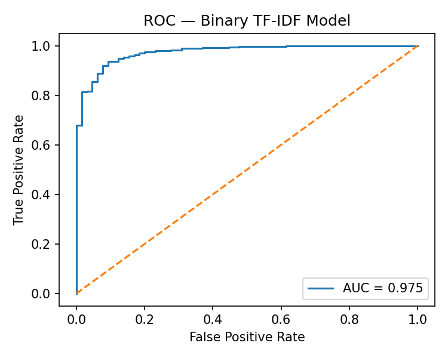
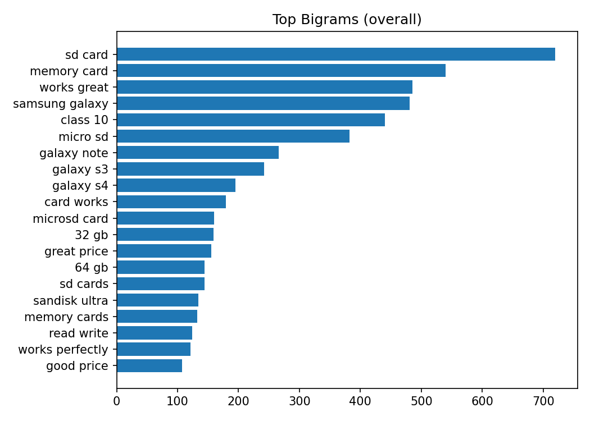
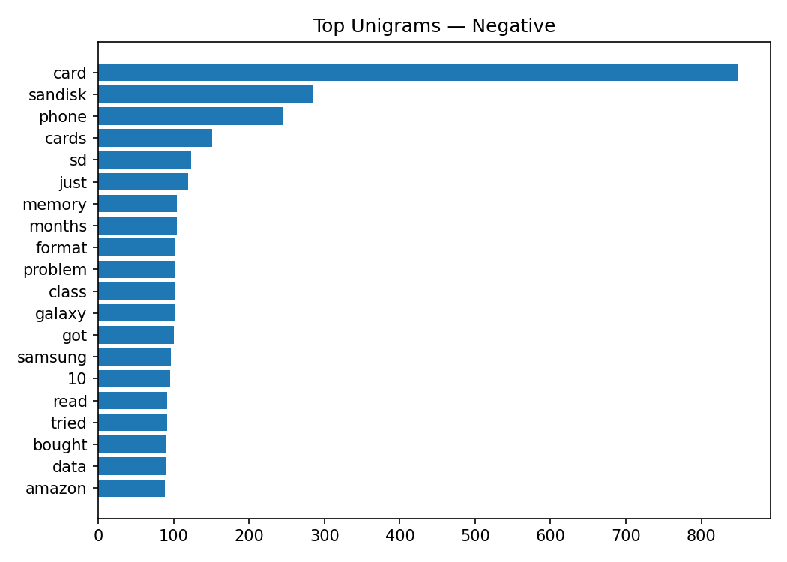
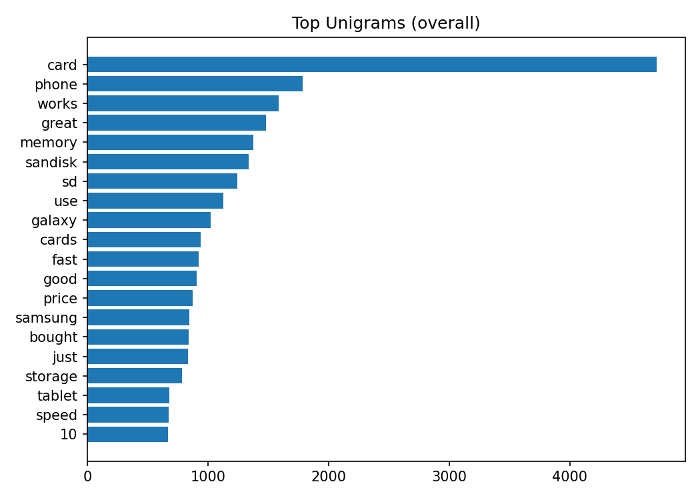
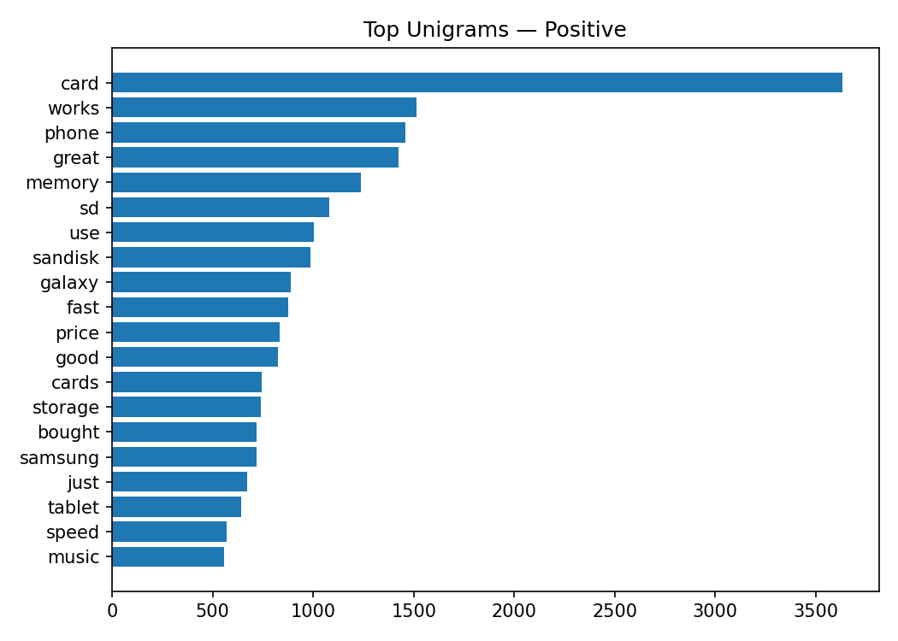

# LLM-Amazon_stars

* **One Sentence Summary** This repository holds an attempt to classify and predict product review sentiment and star ratings using the Amazon Product Reviews Dataset, leveraging both classical ML (TF-IDF + Logistic Regression) and LLM-based feature extraction.
https://www.kaggle.com/datasets/gzdekzlkaya/amazon-product-reviews-dataset/data

## Overview
The task, as defined by the Kaggle dataset, is to use Amazon customer review text and metadata to predict the product’s star rating (1–5) and overall sentiment. The approach in this repository formulates the problem as both:

* Multiclass classification (predicting the exact star rating)
* Binary classification (positive vs. negative sentiment)

We compare the performance of several models:
* TF-IDF + Linear Models
* SentenceTransformer embeddings + Logistic Regression
* Direct pretrained LLM sentiment classifiers

Our best binary model (TF-IDF + LinearSVC) achieved over 90% accuracy on a held-out test set, demonstrating the feasibility of this dataset for sentiment classification.

## Summary of Workdone

### Data

* Data:
  * Type: CSV of Amazon product reviews with fields such as:
    * review (text of the review)
    * star_rating (1–5 stars)
    * Additional optional fields: review summary, product category, helpfulness votes
  * Size: ~4,900 reviews after cleaning
  * Splits:
    * Multiclass: Train/Validation/Test = 80% / 20%
    * Binary: Same split after removing 3-star “neutral” reviews
 
#### Preprocessing / Clean up

* Renamed columns (overall → star_rating, reviewText → review)
* Dropped rows with missing or empty text
* Clipped ratings to 1–5 range
* Created binary sentiment label:
  * Positive: 4–5 stars
  * Negative: 1–2 stars
  * Neutral (3 stars) removed from binary dataset

#### Data Visualization

Key visualizations generated:
* Bar chart of star rating distribution
* Pie chart of binary sentiment split
* Histogram and violin plots of review lengths
* Top unigrams/bigrams overall and by sentiment
* Confusion matrices for binary and multiclass models
* ROC curve for binary classifier
* Word clouds for positive/negative reviews

### Problem Formulation

* Define:
  * Input: Review text (optionally with product metadata)
  * Output:
    * Multiclass: 1–5 star rating
    * Binary: Positive (4–5) or Negative (1–2)
  * Models:
    * TF-IDF + Logistic Regression (multiclass)
    * TF-IDF + LinearSVC (binary)
    * SentenceTransformer embeddings + Logistic Regression
    * Pretrained nlptown/bert-base-multilingual-uncased-sentiment pipeline
  * Metrics:
   * Accuracy
   * Macro F1-score
 
  
### Training

* Describe the training:
  * Environment: Google Colab (CPU/GPU)
  * Libraries: transformers, sentence-transformers, scikit-learn, pandas, numpy, matplotlib, seaborn
  * Duration:
    * Classical ML models: seconds
    * Embedding-based models: minutes
    * Pretrained LLM: minutes (depends on GPU availability)
  * Early stopping determined by monitoring validation accuracy/F1

 
### Performance Comparison

* Multiclass — TF-IDF + LR: Accuracy=0.8026, Macro F1=0.2129
* Binary — TF-IDF + LinearSVC: Accuracy=0.9634, Macro F1=0.8136
* Multiclass — Embeddings + LR: Accuracy=0.8159, Macro F1=0.2739
* Binary — Embeddings + LR: Accuracy=0.9529, Macro F1=0.7508

### Conclusions

* Binary sentiment classification is significantly easier and achieves higher accuracy than predicting exact star ratings.
* TF-IDF remains a strong baseline for text classification.
* SentenceTransformer embeddings improve interpretability and can be plugged into more advanced architectures.
* Pretrained sentiment LLMs perform well out-of-the-box.

### Future Work

* Fine-tune an LLM (e.g., DistilBERT, RoBERTa) directly on this dataset.
* Incorporate additional metadata features (product category, helpfulness votes) into models.
* Explore zero-shot/few-shot sentiment classification with GPT models.

## How to reproduce results

* Open the provided Colab notebook and run all cells (requires dataset download from Kaggle).
* Dataset link: Kaggle — Amazon Product Reviews
* Ensure kaggle CLI is configured to download the dataset or upload manually to /content.

  
### Overview of files in repository

Data_Loading.ipynb	              Loads dataset and required libraries

Data_Preprocessing.ipynb	        Cleans and formats data

Baseline_Model.ipynb	            Baseline description generation

LLM_Generated_Descriptions.ipynb	Runs LLM-based generation

Comparison_Evaluation.ipynb	     Compares models using metrics

Final_LLM_Generated.ipynb	       Full pipeline from data loading to evaluation

### Software Setup
* pip install pandas==2.2.2 numpy==2.0.2 scikit-learn==1.6.1 matplotlib seaborn tqdm
* pip install transformers==4.44.2 sentence-transformers==3.0.1 accelerate

### Data

* Point to where they can download the data.
* Lead them through preprocessing steps, if necessary.

### Training

* Run the Colab notebook. Models are trained on CPU or GPU.
Classical ML runs in seconds, embedding models in a few minutes.

#### Performance Evaluation

Run the evaluation cells at the end of the notebook to generate:
* Metrics tables
* Confusion matrices
* ROC curves
* Saved charts in /figs

## Citations
1. https://www.kaggle.com/datasets/gzdekzlkaya/amazon-product-reviews-dataset/data
